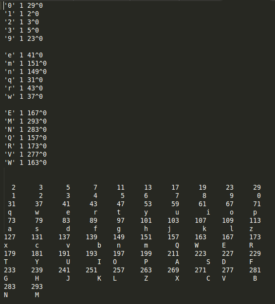
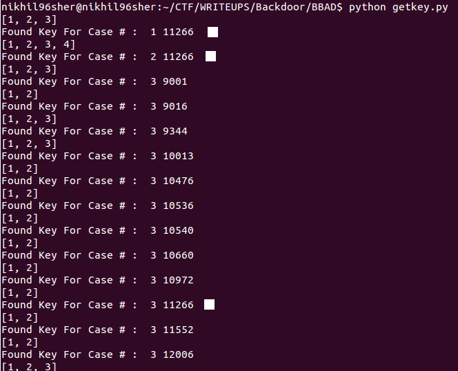
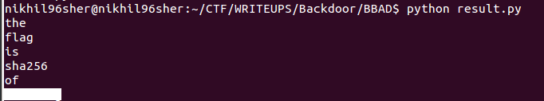

## BBAD (Cryptography) - 200 PTS

### CHALLENGE
NSA has started using a new cryptography algorithm developed by Bat Maze of University of Transylvania. Nemo Labs is planning to exploit this. The organization has managed to get their hands on some files from a disposed computer which might contain some sensitive information, and from communication intercepted earlier they've heard that the key is supposed to be less than 12000. The files are crypted message, test code soure, bash history, output.     
Created by: Vishrut Kumar Mishra

### SOLUTION
* In this challenge, we are given with some bash output which shows a string and a key as input and a number of the form `<some number>^<some other number>` as output.
* Extracting the input and ouput and analyzing those with input `key=1` clearly shows that they are related to prime numbers.
* Seeing the gaps, I observed that it corresponds to a `keyboard layout`. Thus I completed the blanks and mapped each character to a prime number.
* 
* Now, analyzing the output of `V` for different key combinations, I tried dividing `277` (Prime corresponding to V) with given key. The first number was actually the quotient and the second number the remainder.
* Thus, I got to know that the value corresponding to the given string is `value = key*quotient + remainder`. And that this value is related to the primes corresponding to each character.
* So, I took `HJ` and tried dividing this value `13×1067796 + 11 = 13881359` with `239` and `241` and realized `13881359 = 239 * 241 * 241`  
* Similiarly analyzing `abcd` and checking `150479977324775996363` by dividing with `73`,`139`,`131`,`83`, I found out that `150479977324775996363 = 73 * 139 * 139 * 131 * 131 * 131 * 83 * 83 * 83 * 83` i.e. The value of a given string is = `product of pow(prime[s[i]],i) for i in range(0,len(s)) ` 
* Realizing this, I wrote a python script `getkey.py` which bruteforced over all numbers from `1 to 100000` and checked if any of these keys satisfy the properties discovered on the given crypted text.
* From the script, I got the output key as `11266` (Each of the crypted text satisfied this key)
* 
* So, I found the factors of the value of each of the crypted text with the key 11266 and decoded it using `result.py` and there was the flag.
* 
* Kudos to the creator for such an interesting challenge.