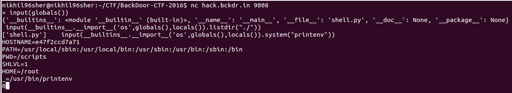

## WORST PWN EVER (Pwning, Python, Environment) - 100 PTS

### CHALLENGE
tocttou is an enviornmentalist. But some say he has a vicious motive and he uses nature to hide his dark side. We found a weird shell on his amazon (pun inteded) web services. Can you tell us what is he upto?  
Tip: he might shut down the machine if he notices you – and he will (maybe in 45 seconds).  
Access: nc hack.bckdr.in 9008   
Created by: Ashish Chaudhary

### SOLUTION
* This challenge is my favorite from the contest.
* You are given an online service running at `nc hack.bckdr.in 9008` which when connected to ask for some input.
* Little tweaking around and the errors displayed like`NameError: invalid syntax (<string>, line 1)` made us realize its a Python Shell.
* Trying out various codes showed that, in case the statement doesn't raise exception, it exits. So, we needed something that would make the shell wait and input() did the job. 
* `input(globals())` showed us what all modules are available.
* To access his directories, file, execute commands we needed to import os module. Direct import didn't work, so we went to the basic and used 
`input(__builtins__.__import__('os',globals(),locals())))` and that did the trick.
* The most interesting part was to figure out what to do next. Reading the problem description again and again made us realize the focus on `environmentalist` and the need to check the `ENVIRONMENT` and we fired    
`input(__builtins__.__import__('os',globals(),locals()).system("printenv"))`.
* Boom!! There was a variable named `_F_L_A_G_ = 'SHA256{-------------------}'`.
* 